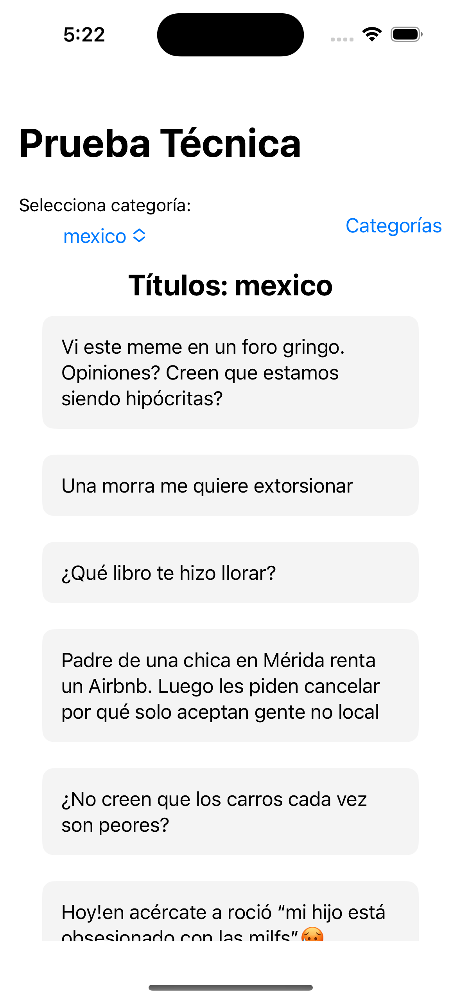
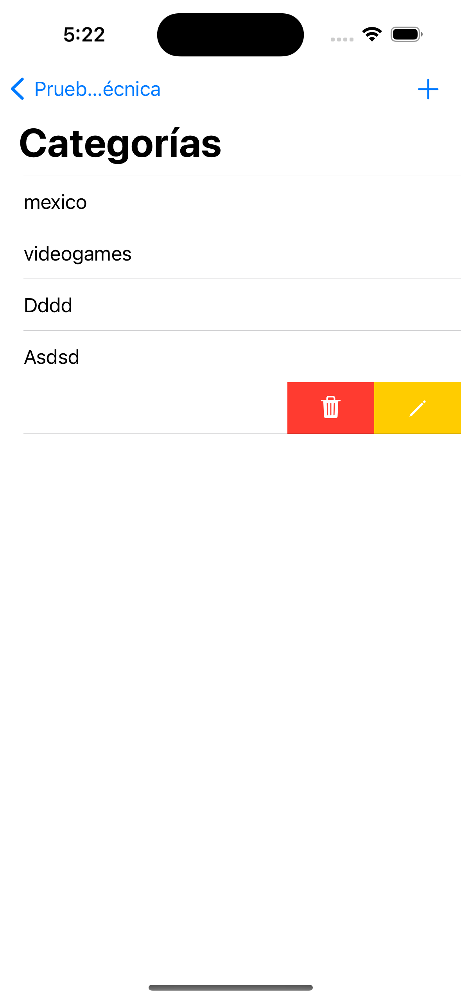
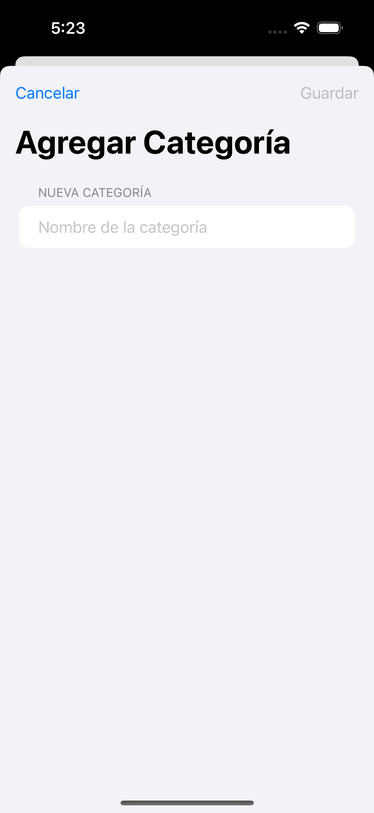
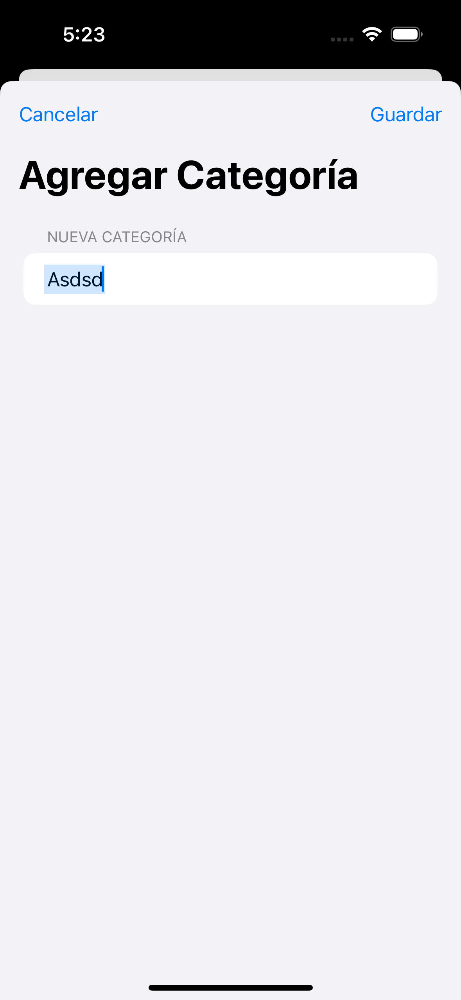

# pruebareddit
prueba tecnica iOS

Este proyecto es una aplicación SwiftUI que permite al usuario consultar títulos de Reddit en diferentes categorías. También proporciona la funcionalidad de administrar categorías, como agregar, editar y eliminar categorías.

## Características

- Consulta títulos de Reddit en categorías seleccionadas.
- Administra categorías: agregar, editar y eliminar.
- Interfaz de usuario intuitiva y fácil de usar.
- Integración con una base de datos local para almacenar categorías.

## Requisitos del Sistema

- iOS 14.0 o superior.
- Xcode 12.0 o superior (para desarrollo).

## Uso

1. Clona o descarga el repositorio en tu máquina local.
2. Abre el proyecto en Xcode.
3. Compila y ejecuta la aplicación en el simulador de iOS.

## Capturas de Pantalla

*Descripción de la captura de pantalla 1.*

*Descripción de la captura de pantalla 2.*

## Estructura del Proyecto

- `ContentView.swift`: La vista principal de la aplicación que muestra los títulos de Reddit.
- `CategoriesView.swift`: Vista para administrar categorías.
- `AddCategoryView.swift`: Vista para agregar una nueva categoría.
- `EditCategoryView.swift`: Vista para editar una categoría existente.
- `DBManager.swift`: Gestión de la base de datos local.
- `ListViewModel.swift`: ViewModel para obtener datos de Reddit.
- `Models`: Carpeta que contiene los modelos de datos utilizados.
